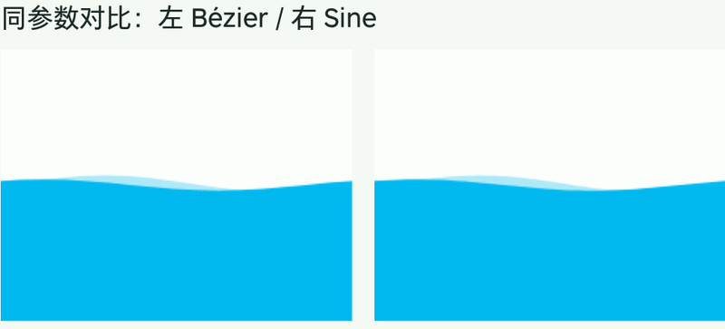
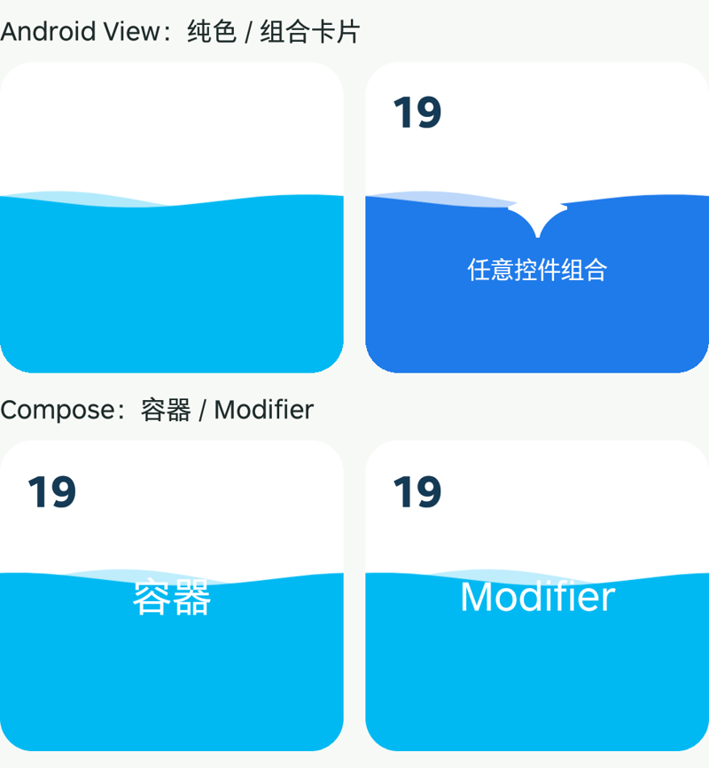

# Smartisan Icon Wave Demo · 双波实验

研究 Smartisan OS 桌面图标下载水波纹，并将效果提炼为可复用的 **Wave Reveal 正弦波库**。Kotlin 实现，无网络上传。

## 三个版本

| 分支 | 内容 | 用途 |
| --- | --- | --- |
| [`main`](https://github.com/wangrunsheng/smartisan-icon-wave-demo/tree/main) | 三次贝塞尔双波、控制柄比例 0.36 | 保留最初拟合版本 |
| [`sine-wave`](https://github.com/wangrunsheng/smartisan-icon-wave-demo/tree/sine-wave) | 同参数正弦双波、缓存路径平移 | 验证曲线替换的效果 |
| [`wave-reveal-library`](https://github.com/wangrunsheng/smartisan-icon-wave-demo/tree/wave-reveal-library) | 通用参数、View / Compose 组件、示例与对比 | 当前库开发分支 |

## 贝塞尔与正弦：实际动画对比



以上为锤子手机上对比页面的实际录屏裁切：**左 Bézier、右 Sine**。两侧共享一个时钟，使用相同波长、振幅、相位、周期、透明度和固定水位，仅改变曲线构造。使用纯色以便观察边缘，不依赖 Chrome 素材。GIF 为压缩预览，不能用它测量亚像素误差。

- 贝塞尔：每半波一段 cubicTo，控制柄为半波宽的 0.36；原 Demo 每帧重建少量曲线。
- 正弦：用显式 sin 公式定义形状，预生成路径，每帧平移。参数与时间分别控制形状和运动。
- 两者都能预生成后平移；缓存不是正弦独有优势。
- 相位对齐时，这组贝塞尔与正弦的最大高度差约为振幅的 **0.275%**。以旧 Demo 180 单位参考系、1080px 宽画布估算，最大差不到 0.09px，因此实际观感非常接近。
- 通用库选择正弦，因为振幅、波长、周期、相位直接对应公式。没有宣称它实测比贝塞尔更快，也不能据此证明 Smartisan 内部用了正弦。

## 可复用库



```text
wave-core      公共参数、正弦公式、误差受控的路径采样
wave-view      Android View / ViewGroup 容器
wave-compose   commonMain 中的 Compose 组件，Android / JVM / iOS / Wasm 共用
app            纯色、组合卡片、照片、Compose 卡片与曲线对比
```

提供源码模块，尚未发布 Maven Central。传统 View 使用 `WaveRevealLayout`；Android Compose 与 Compose Multiplatform 使用同一个 `WaveReveal`，内部没有 AndroidView 包装。平台验证状态见 [接入文档](docs/LIBRARY.md#平台验证)。

最小用法：只传进度，内部自动管理波动时钟。

```kotlin
WaveReveal(progress = progress) {
    ExistingCard()
}
```

已有组件支持 Modifier 时，无需额外包装容器：

```kotlin
ExistingCard(modifier = Modifier.waveReveal(progress = progress))
```

两个入口共用绘制实现。默认在进度端点暂停时钟；用 `running` 暂停、`speed` 调速。背景、被揭示的内容、固定覆盖层需要分别控制时使用容器的 `backdrop` / `content` / `overlay` 槽。高级用法仍可传 `timeSeconds` 共享外部时钟。

```kotlin
val spec = remember {
    WaveRevealDefaults.DoubleWave.copy(contentOpacity = .8f)
}
WaveReveal(progress = progress, spec = spec, running = playing) {
    ExistingCard()
}
```

`ExistingCard` 代表接入方已有的组件；这些片段位于 `@Composable` 函数内。库不依赖 Material，不接管图片加载、点击或无障碍。完整 imports、参数表和 Modifier 顺序见 [接入文档](docs/LIBRARY.md)。

Android View 接法：

```kotlin
val reveal = WaveRevealLayout(context).apply {
    setBackdrop(View(context).apply { setBackgroundColor(Color.WHITE) })
    setContent(View(context).apply { setBackgroundColor(0xFF00B9F2.toInt()) })
    cornerRadiusPx = 16f * resources.displayMetrics.density
    progress = .55f
}
```

以上示例传入白色背景和蓝色内容，配合默认蒙版得到浅蓝后波与蓝色前波；库本身不指定内容颜色。换照片或控件组合只需换 setContent；数字“19”可用 setOverlay 保持在波形上方。基础透明度、每条波的不透明度和整组内容不透明度都可配置。

完整的公式、参数单位、依赖接入、生命周期和支持边界见 **[库接入文档](docs/LIBRARY.md)**。打开应用即可运行示例。

## 构建

JDK 17、Gradle 9.4.1、AGP 9.2.0、Kotlin 2.3.21、Compose Multiplatform 1.10.3、Android SDK 36；最低 Android API 26。首次构建需联网下载依赖。配置 `ANDROID_HOME` 或本地 `local.properties` 后运行：

```sh
./gradlew :app:assembleDebug :app:lintDebug :wave-core:jvmTest :wave-compose:jvmTest :wave-view:lintDebug
./gradlew :wave-compose:compileKotlinJvm :wave-compose:compileKotlinWasmJs
adb install -r app/build/outputs/apk/debug/app-debug.apk
```

macOS 安装 Xcode 后可编译 iOS：

```sh
./gradlew :wave-compose:compileKotlinIosArm64 :wave-compose:compileKotlinIosSimulatorArm64
```

GitHub Actions 仅手动触发，本地构建不会启动远程任务。库不访问网络、不选择照片；示例通过系统选择器读取照片。屏幕在示例前台保持亮起，退到后台暂停动画。

## 素材与历史版本

本分支已移除 Chrome 图标素材及旧图标演示，历史演示仍留在 `main` 和 `sine-wave`。启动图标使用独立设计的蓝色双波 PNG，包含 mdpi–xxxhdpi 五档尺寸，无额外 SVG 文件。

这是基于录屏观察的独立研究项目，不隶属于 Smartisan，也不代表其官方实现。代码使用 [MIT](LICENSE) 许可证；贡献规范见 [CONTRIBUTING.md](CONTRIBUTING.md)。
